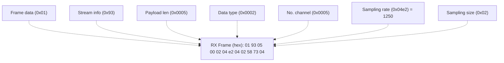
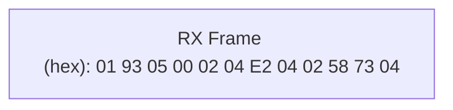
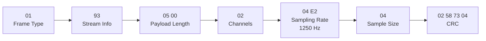
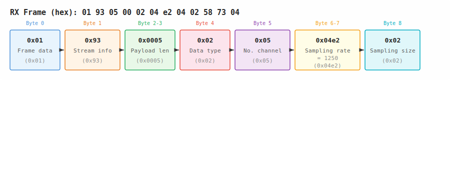

My flowchart

```mermaid

flowchart TB
    A["Frame data (0x01)"]
    B["Stream info (0x93)"]
    C["Payload len (0x0005)"]
    D["Data type (0x0002)"]
    E["No. channel (0x0005)"]
    F["Sampling rate (0x04e2) = 1250"]
    G["Sampling size (0x02)"]
    
    H["RX Frame (hex): 01 93 05 00 02 04 e2 04 02 58 73 04"]

    A -.-> H
    B -.-> H
    C -.-> H
    D -.-> H
    E -.-> H
    F -.-> H
    G -.-> H
```

```mermaid
flowchart TB
    H["RX Frame (hex):&nbsp;01&nbsp;93&nbsp;05&nbsp;00&nbsp;02&nbsp;04&nbsp;E2&nbsp;04&nbsp;02&nbsp;58&nbsp;73&nbsp;04"]
```

```mermaid
flowchart LR


    A["01<br/>Frame Type"]
    B["93<br/>Stream Info"]
    C["05 00<br/>Payload Length"]
    D["02<br/>Channels"]
    E["04 E2<br/>Sampling Rate<br/>1250 Hz"]
    F["04<br/>Sample Size"]
    G["02 58 73 04<br/>CRC"]

    A --> B --> C --> D --> E --> F --> G
```

